```{r setup, include=FALSE}
knitr::opts_chunk$set(echo = TRUE)
```

### Part 1. Data Cleaning

***"What kind of pet is this (Dog, Cat, Bird, Other)"***
Firstly, created a new project in *OpenRefine* and loaded the *PetNames.tsv* dataset by copying the *URL* directly into *OpenRefine*. After reviewing the data, observed that in each column there are a lot of spelling mistakes, mismatches. Also, same name (example: Rabbit) was entered differently (example: rabit, bunny, and many such). So, to change them all to a correctly spelled word (Rabbit), used *"Edit cells -> Cluster and edit"* then used *"Method: key collision; Keying Function: fingerprint"*. After selecting the required entries to combine, clicked on *"Merge Selected & Re-Cluster"*. Then there were similar word (Rabbit) entries. Now selected *"Keying Function: ngram-fingerprint"* with *"Ngram Size: 2"* again combined the pet names of same kind. Continued this by cselecting the *"Ngram Size"* till there were no mismatches. Then selected *"Keying Function: metaphone3"* and combined the pet names of same kind. Now, selected the last *"Keying Function: cologne-phonetic"*, combined the pet names of same kind. Finally, selected *"Method: nearest neighbor -> Distance Function: levenshtein -> Radius: 1.0 -> Block Chars: 6"* and did the same process as done with the first type of method. Then changed the Radius and Block Chars and did the data cleaning. Similarly for the next *"Distance Function: PPM"* also.
Similarly I cleaned the entire column "What kind of pet is this (Dog, Cat Bird, Other)" by using *"Edit cells -> Cluster and edit"*.

There was a *"Dog, dog, dog, cat"* row in the *"What kind of pet is this (Dog, Cat, Bird, Other)"*. By using *"Edit cells -> Split multi-valued cells -> OK"* it was split into different rows. Since there were alredy existing rows with names *"Dog"* and *"Cat"*, they combined to thier respective rows automatically.


***Pet's age***
In the Pet's age column, there were many words used. Since this is a numeric column, I wanted to change them to the possible numbers.
First clicked on *"Facet -> Numeric facet"* to know the Non-Numeric value. Then started cleaning the column by using *"Edit cells -> Transform"*. Then in the dialgoue box appeared, under Expression section, to replace the value, used *"value.replace("6 1/2", "6.5").replace("ish", "").replace("yrs", "").replace("~", "")"*. So, basically used *"value.replace("", "")"* to makes changes. There were few rows where the age was mentioned in months and weeks. To change given month to year, I dividied the given age by 12 and for weeks to year, divided the age by 52.1774 
Some of the pet's age was described as *"deceased, deceased at 13, 30 but deceased at 13"*. All were combined to *"Deceased"* by using *"Edit cells -> Cluster and edit"*.


***Pet's breed***
For the *"Pet's breed column"* cleaned the data by using *"Edit cells -> Cluster and edit"*. After editing, there were some more with spelling mistakes. To make them right or change them, used *"Facet -> Text facet"*, clicked on edit in the facet and changed the name to right spelling or combined to already existing format.
For example, changed *"GSD"* to *"German Shepherd"*, *"Mixed breeds like Yorkie Poodle to Mixed"* and spelling mistakes like *"Sheperd to Shepherd"*.
By browsing from internet, came to know that *"mutt"* is also considered as word for *"mixed breed"*. So combined it using edit option in the facet.


### Part 2. Analyze Cleaned Data

#### 1.How many types (kinds) of pets are there?
After cleaning the dataset, under *"What kind of pet is this"* section, selected *"Facet -> Text facet"*
Here, I found that there are **"29 kinds of pets"**.
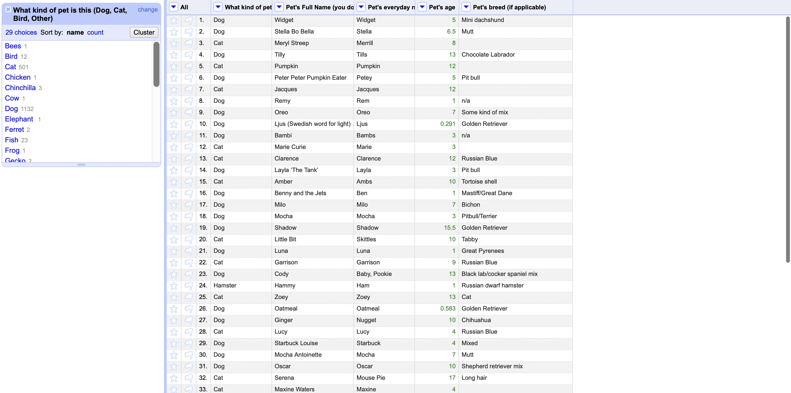

#### 2.How many dogs?
After cleaning the dataset, under *"What kind of pet is this"* section, clicked on *"Text filter"* and type *"Dog"*. Then I found that there are **"1132"** matching rows with the name *"Dog"*
So, there are **"1132 Dogs"**.
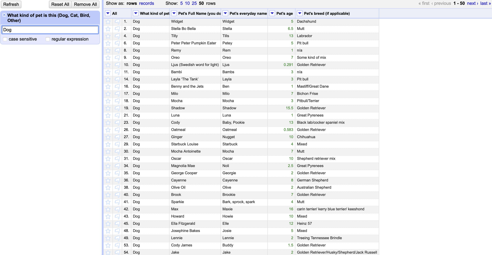

#### 3.How many breeds of dogs?
After cleaning the data, under *"What kind of pet is this"* section, clicked on *"Text filter"* and type *"Dog"*. Then under *"Pet's breed"* section, selected *"Facet -> Text facet"*. 
Observed that there are 167 breeds of dogs. But there are 29 entries of 1 kind shown as n/a. So, there are 167-1 = 166 breeds of dogs. 
Hence there are **"166 breeds of dogs"**
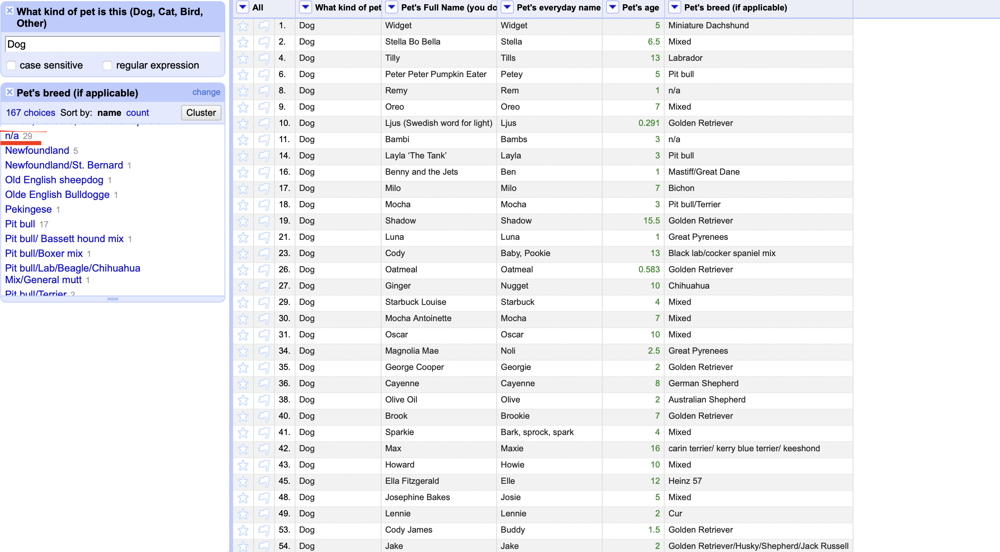

#### 4.What's the most popular dog breed?
After cleaning the data, under *"What kind of pet is this"* section, clicked on *"Text filter"* and type *"Dog"*. Then under *"Pet's breed"* section, selected *"Facet -> Text facet"*. Then clicked on *"count"* in the facet to observe the most popular dog breed.
So, there are 326 Mixed breeds. We don't know which kind of bredds are mixed exactly. So, that is not taken as the highest count.
Then next there is Golden Retriever which has a count of 172.
Hence, the most popular dog breed is **"Golden Retriever"**.
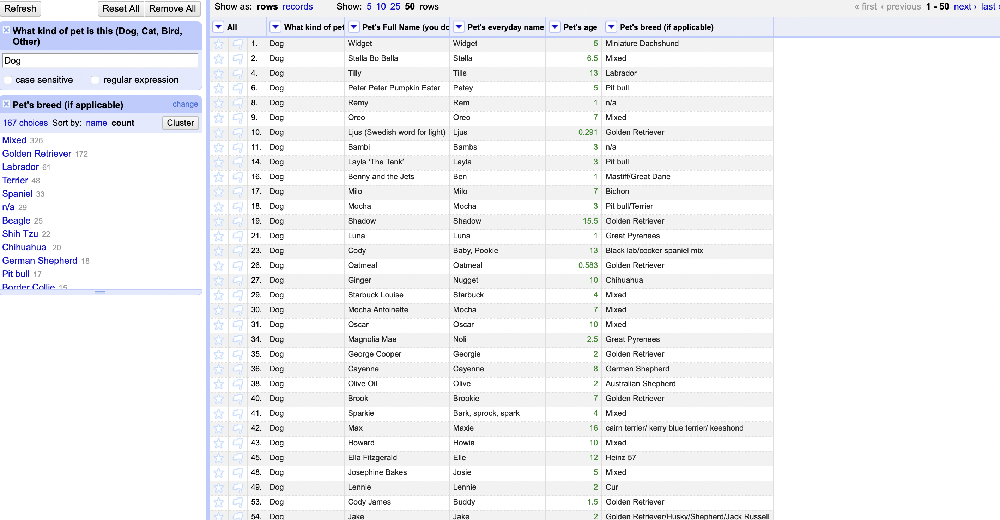

#### 5.What's the age range of the dogs?
First, under *"What kind of pet is this"* section, clicked on *"Text filter"* and type *"Dog"*.
In the Pet's age column, select *"sort -> numbers -> largest first"* to know the oldest pet and then select *"sort -> numbers -> smallest first"* to know the youngest pet.
The age of dogs ranges from **"22 to 0.125 years"**.
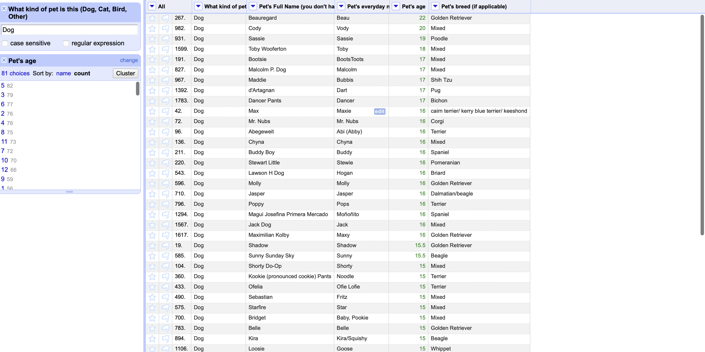
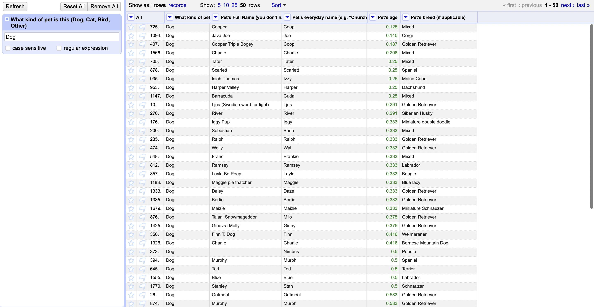

#### 6.What's the age range of the guinea pigs?
First, under *"What kind of pet is this"* section, clicked on *"Text filter"* and type *"Guinea pig"*.
In the Pet's age column, it is clearly seen since there are less number of rows in this type of pet.
The age of guinea pig ranges from **"1 to 5 years"**.
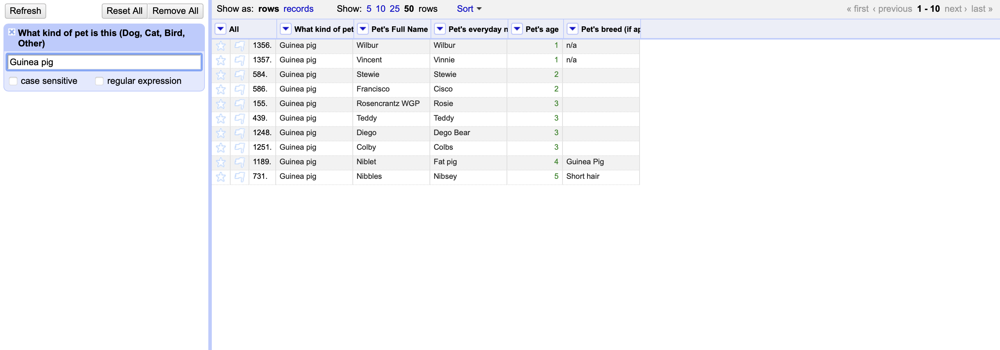

#### 7.What is the oldest pet?
In the Pet's age column, select *"sort -> numbers -> largest first"* to know the oldest pet.
The oldest pet is the Cat, whose full name is *"Bruce Springsteen"*, pet's evertday name is *"Bruce"*, whose **"age is 24 years"** and it's breed is Cat.
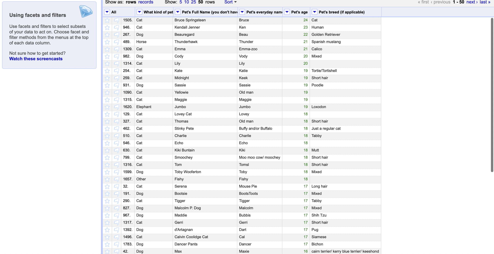
#### 8.Which are more popular, betta fish or goldfish? How many of each?
First, under *"What kind of pet is this"* section, clicked on *"Text filter"* and type *"Fish"*. Then under *"Pet's breed"* section, selected *"Facet -> Text facet"*.
There are *"11 Betta fish and 4 Gold fish"*. So, **"Betta fish"** is the popolar amongst Betta and gold fish.
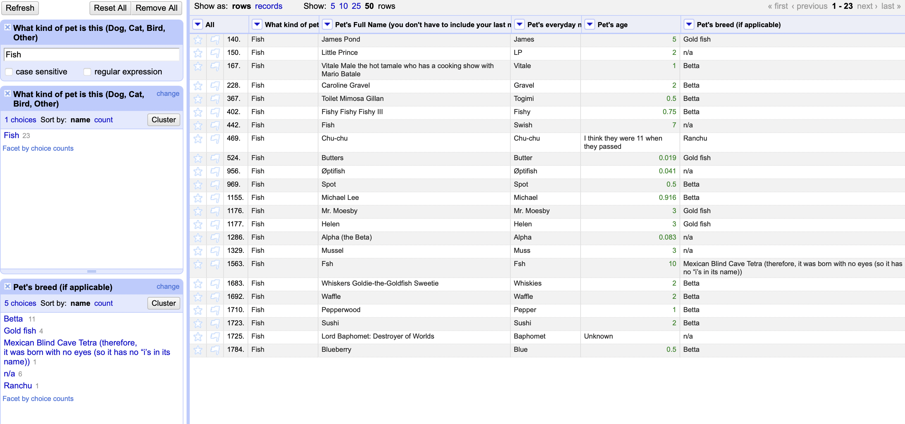

#### 9.What's the most popular everyday name for a cat?
First, under *"What kind of pet is this"* section, clicked on *"Text filter"* and type *"Cat"*. Then under *"Pet's everyday name"* section, selected *"Facet -> Text facet"*. Then click on *"count"* in the facet to get the popular everyday name for a cat.
**"Kitty"** is the popualr everyday name for a cat as it has the highest count of 8 when compared to other cat names.
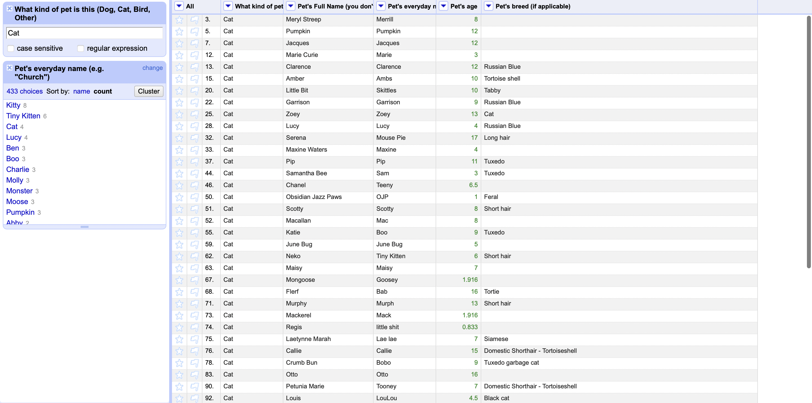

#### 10.What's the most popular full name for a dog?
First, under *"What kind of pet is this"* section, clicked on *"Text filter"* and type *"Dog"*. Then under *"Pet's full name"* section, selected *"Facet -> Text facet"*. Then click on *"count"* in the facet to get the popular full name for a dog.
**"Charlie"** is the popualr everyday name for a cat as it has the highest count of 13 when compared to other cat names.
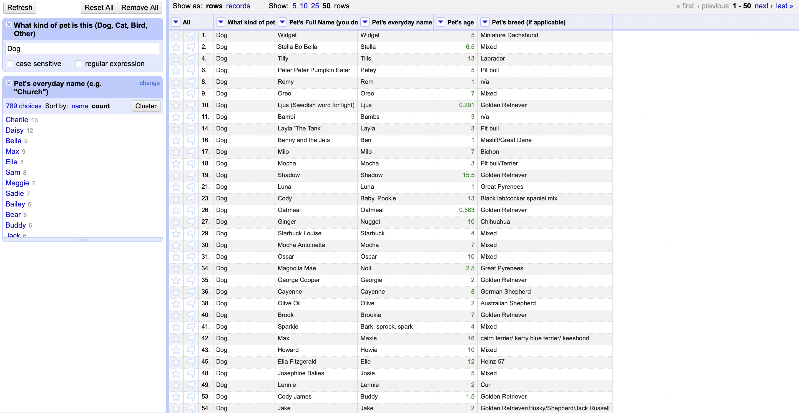

#### References:-

**Breeds of dogs:-** [Reference 1](https://www.google.com/search?q=dog+breeds&client=safari&bih=820&biw=1440&hl=en&ei=ZZBKYcijKfCgqtsP84Gr4As&oq=dog+brred&gs_lcp=Cgdnd3Mtd2l6EAMYADIHCAAQsQMQQzIECC4QQzIECAAQQzIECAAQQzIECAAQQzIHCAAQsQMQQzIHCAAQyQMQCjIFCAAQkgMyBwgAELEDEEMyBwgAELEDEAo6BwguEEMQkwI6BQgAEJECOgcILhCxAxBDOgoIABCxAxDJAxBDOggIABCABBDJAzoLCAAQgAQQsQMQyQM6CAgAEIAEELEDSgQIQRgAULOHzwFY_JTPAWCSsc8BaAFwAngAgAFqiAH9BZIBAzYuM5gBAKABAbABAMABAQ&sclient=gws-wiz)
**Breeds of cats:-** [Reference 2](https://www.purina.com/cats/cat-breeds)
**Types of fish to keep as pets:-** [Reference 3](https://scratchpay.com/blog/popular-types-of-pet-fish)
**About mutt:-** [Reference 4](https://en.wikipedia.org/wiki/Mongrel)


